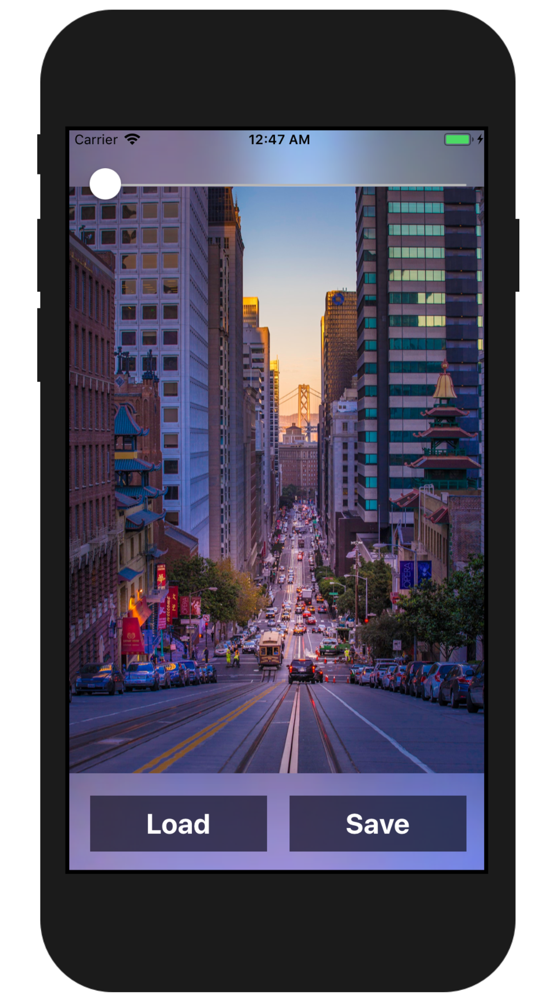
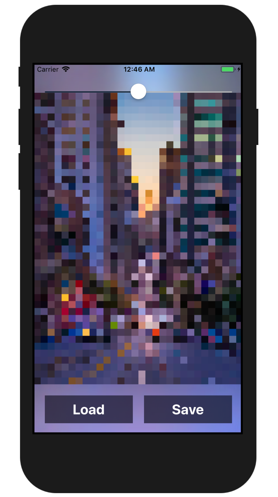
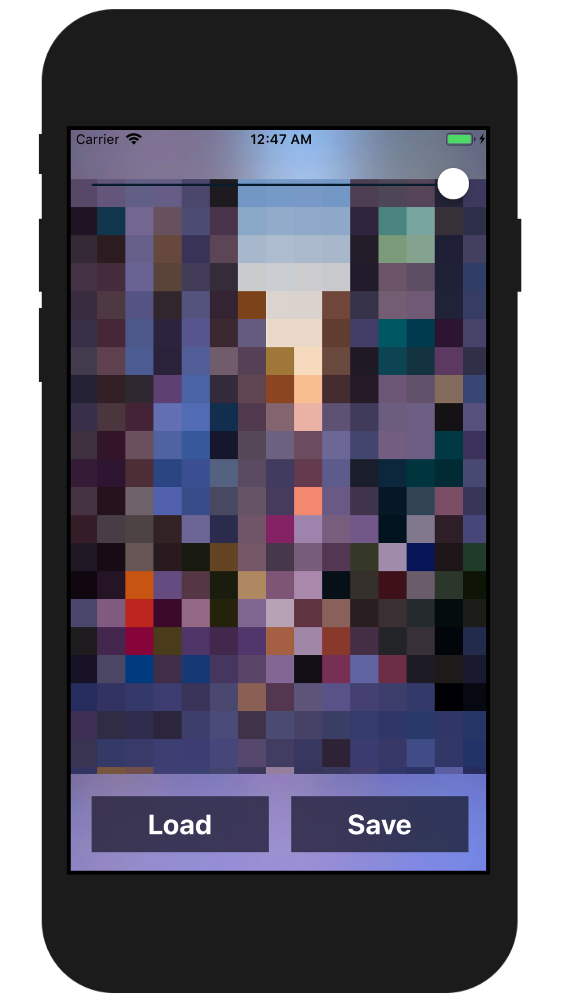

<h3 align="center">
  
</h3>

# Pixelizator

Pixelize your images with Swift or Python.

## Swift (iOS)

## Python

### Usage
`python pixelizator.py <pixel_size> <scale>`

	pixel_size: default 8
	scale: default 1

### Input

### Output
